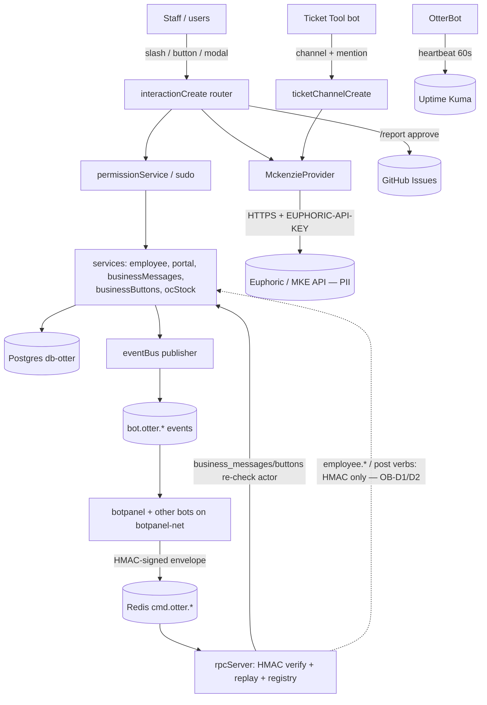
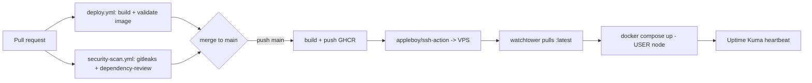
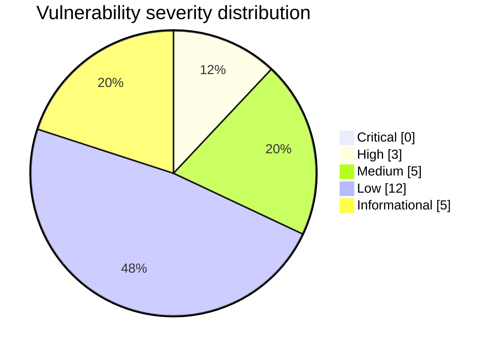

# Otterbot — Security & Reliability Review

**Repository:** `jason-tucker/otterbot` · **Reviewed commit:** `6d09314` (HEAD of `main` at review start)
**Remediation branch:** `claude/clever-fermi-5nxy2j` · **Date:** 2026-06-09
**Reviewer:** automated multi-agent review (6 parallel research agents + manual corroboration)

> Scope note: production deployment was **not** performed. Two behavior-sensitive
> fixes (RPC actor-authorization, migration drift) were left as **documented
> recommendations with exact diffs** at the operator's request — see
> `REMEDIATION_PLAN.md`. Everything else was fixed, tested, and committed on the
> branch above.

---

## Executive summary

Otterbot is a TypeScript / discord.js staff-management bot (PostgreSQL via Drizzle,
Redis pub/sub, no web server of its own). It is **substantially better built than the
"vibe-coded" worst case**. Pre-existing controls that held up under review:

- CSPRNG (`crypto.randomBytes(16)`) interaction-session keys, 1 h / 24 h TTL, expiry enforced on read.
- HMAC-SHA256-signed RPC envelopes with constant-time compare, 30 s replay window, and request-id dedupe.
- Global `allowedMentions: { parse: [] }` neutralising mention-injection.
- Audit-log secret redaction; PII-aware structured logging that never serialises MKE response bodies.
- Parameterised Drizzle queries throughout — **no SQL injection**.
- `http(s)`-only URL validation rejecting `javascript:` / `data:` on every write path.
- Real (non-fake) unit tests for the permission predicates.
- **No AI/LLM components** (see `AI_SAFETY_REVIEW.md`) and **no secrets** in the tree or git history.

The real risk concentrated in three areas:

1. **The Redis RPC trust boundary** (shared `botpanel-net`): privileged verbs (`employee.*`, `oc.stock_post`, `caked.message_post`, `business.sync_roles`, `meta.*`) authorise on **HMAC only — no per-actor rank check**. `employee.promote` can grant a DB-authoritative `owner` row. *(Documented — OB-D1/OB-D2.)*
2. **A public ticket select menu** disclosing MKE PII (CSN / phone / bank) with **no authorization**. *(Fixed — OB-03.)*
3. **Migration drift**: `lookup_sessions` and the perf indexes have **no migration file**, so a clean deploy breaks `/lookup`'s note buttons; the container also runs `drizzle-kit push --force` at boot. *(Documented — OB-D3.)*

**Overall risk rating:** **Medium**. The most severe issues (OB-D1, OB-D3) are gated behind the secrecy of `BOTPANEL_RPC_SECRET` + a private Docker network, and the panel is the same owner — but they are genuine single-points-of-failure that warrant the documented hardening.

**Safe to deploy?** The committed changes are safe to merge and deploy (no behavior change to the live panel integration; all tests green). The two **document-only** items require operator action with a DB backup before applying (see `DEPLOYMENT_AND_ROLLBACK.md`).

**Biggest fixed issues:** ticket PII authorization (OB-03), lookup-embed phishing via Send-to-Channel (OB-01), CI supply-chain hardening (OB-12), non-root container (OB-14), event-bus socket leak on shutdown (OB-08).

**Biggest remaining risks:** RPC `employee.*` privilege escalation (OB-D1) and migration drift / `push --force` (OB-D3) — both documented with exact diffs and explicitly deferred.

---

## Coverage

| Area | Status | Notes / evidence |
|---|---|---|
| Repo map / architecture | completed | System map in `THREAT_MODEL.md` |
| Threat model | completed | `THREAT_MODEL.md` |
| Secrets (tree + full git history) | completed | None found; manual ripgrep + `git log` sweeps (no gitleaks/trivy installed) |
| Dependency / supply chain | completed | `DEPENDENCY_AND_SBOM_NOTES.md`; `pnpm audit` |
| Auth / authz / data isolation | completed | OB-03, OB-09, OB-10 fixed; OB-D1/OB-D2 documented |
| Injection / SSRF / validation | completed | SQL/SSRF clean; OB-01/02/06/11 fixed |
| AI / LLM / RAG safety | completed (N/A) | `AI_SAFETY_REVIEW.md` — no AI components |
| Infra / Docker / compose | completed | OB-14 fixed; compose findings documented |
| CI/CD security | completed | OB-12/OB-13/OB-15 fixed |
| Performance / reliability | completed | OB-07/OB-08/OB-17 fixed; sync_roles loop documented |
| Database / data safety | partial | OB-11 fixed; OB-D3 (migration drift) documented — needs DB access to apply safely |
| Tests / QA | completed | Suite run green; regression tests added; `TEST_RESULTS.md` |
| Staging / DAST | not executed | No staging target; Discord bot has no HTTP surface to scan |
| Production deploy | not executed | Out of scope; not authorised |

---

## Findings register

Severity = impact; Confidence = certainty of the finding. "Fixed" items are committed on the branch; "Documented" items have exact diffs in `REMEDIATION_PLAN.md`.

| ID | Sev | Conf | Category (CWE) | File / line | Impact | Fix | Test | Status |
|----|-----|------|----------------|-------------|--------|-----|------|--------|
| OB-03 | High | High | Missing authz / PII disclosure (CWE-862/639) | `interactions/selects/ticketCharSelect.ts:45` | Any member who can see a ticket channel could pick from the public select and disclose another user's CSN/phone/bank | Gate to self / McKenzie staff / ManageChannels before `deferUpdate`; deny ephemerally | code review (interaction-coupled) | **Fixed** `6667171` |
| OB-01 | Medium | High | Markdown link injection / phishing (CWE-74) | `embeds/customerEmbed.ts:32` | Crafted character name breaks out of `[label](url)` → attacker link in the public Send-to-Channel post | `safeMarkdownLinkLabel` + `encodeURIComponent`; escape reasons | `embeds/embedEscaping.test.ts` | **Fixed** `e07b1c6` |
| OB-02 | Low | High | Markdown/format injection (CWE-74) | `embeds/ticketCharacterEmbed.ts:48`, `embeds/businessEmbed.ts:22` | Crafted name/CSN hijacks formatting / breaks code spans in public posts | `safeMarkdown` / `safeInlineCode` | `embeds/embedEscaping.test.ts` | **Fixed** `e07b1c6` |
| OB-08 | Medium | High | Resource leak / unclean shutdown | `index.ts:41` | Redis publisher socket never closed on SIGTERM/SIGINT → leak / event-loop keepalive / dropped in-flight publishes | `await closeEventBus()` in `gracefulShutdown` | code review | **Fixed** `239cd49` |
| OB-07 | Low | High | Uncontrolled resource / hang (CWE-400) | `bot/healthPush.ts:15`, `interactions/buttons/reportReview.ts:68` | No timeout on Kuma push / GitHub POST → hung socket per minute, wedged interaction | `AbortSignal.timeout` + rate-limited failure log | code review | **Fixed** `239cd49` |
| OB-04 | Low | Med | No-ping consistency (defense in depth) | `services/rpc/handlers/oc.ts:61` | RPC post to arbitrary channel relied on global mention default only | explicit `allowedMentions:{parse:[]}` | n/a | **Fixed** `f74eb72` |
| OB-05 | Low | Med | Abuse / DM+issue flooding | `services/rpc/handlers/report.ts` | `report.submit` RPC verb bypassed the `/report` cooldown | snowflake-validate + 5 min per-user cooldown | n/a | **Fixed** `f74eb72` |
| OB-06 | Low | High | Inconsistent input validation | `rpc/handlers/{business,business_messages,business_buttons}.ts` | Snowflake regex `{15,25}` accepted IDs the rest of the bot rejects | tighten to canonical `{17,20}` | `utils/validators.test.ts` | **Fixed** `f74eb72` |
| OB-09 | Low | Med | Cross-business object removal (CWE-639) | `services/portalService.ts:312`, `interactions/selects/portalSelect.ts:63` | Stale/forged select value could delete another business's role mapping (sudo-only) | scope delete to `expectedBusinessId` | code review | **Fixed** `b2dbbd0` |
| OB-10 | Low | Med | Privilege bleed across tenants (CWE-863) | `interactions/selects/businessEmployeeSelect.ts:44`, `interactions/modals/businessSearchSubmit.ts:39` | Roster lookup of an unowned business inherited the user's highest unrelated rank | least-privilege `employee` fallback | code review | **Fixed** `b2dbbd0` |
| OB-11 | Low | High | Unvalidated config / input | `config/env.ts`, `interactions/modals/noteSubmit.ts:15` | `REDIS_URL` (RPC channel) read raw; marker type unbounded `Number()` | add to zod schema; clamp to `VISIBLE_MARKER_TYPES` | n/a | **Fixed** `9acfa23` |
| OB-12 | Medium | High | CI supply chain (CWE-1357) | `.github/workflows/deploy.yml` | Floating action tags (incl. the action holding the VPS SSH key); no deny-all default perms | SHA-pin all actions; top-level `permissions:{}` | n/a | **Fixed** `aa3ff98` |
| OB-13 | Low | Med | GHA script injection (CWE-94) | `.github/workflows/notify-panel-schema-change.yml:32` | `head_commit.message` interpolated inline in `run:` | pass via `env:` var | n/a | **Fixed** `aa3ff98` |
| OB-14 | Medium | High | Container runs as root (CWE-250) | `Dockerfile` | bot process ran as uid 0 | `USER node` + workdir chown | n/a | **Fixed** `9529dc6` |
| OB-15 | Low | High | No secret scanning in CI | (new) `.github/workflows/security-scan.yml` | committed secrets only caught by manual review | gitleaks + dependency-review workflow | n/a | **Fixed** `3055ccc` |
| OB-16 | Low | High | Vulnerable dev dependency | `package.json` | `vitest <3.2.6` (GHSA-5xrq-8626-4rwp, dev-only) | bump to `^3.2.6` | suite green | **Fixed** `17d2c63` |
| OB-17 | Low | High | Missing rate limit | `commands/business.ts` | only un-throttled external-API command | 30 s per-user cooldown (sudo bypass) | code review | **Fixed** `7013a33` |
| OB-18 | Info | High | No trust-boundary test coverage | `utils/*.test.ts` | HMAC/replay, URL validators, escaping untested | add regression tests (54 → 71) | new tests | **Fixed** `e07b1c6`/`f74eb72`/`7c13cab` |
| **OB-D1** | **High** | High | Missing authz on RPC `employee.*` (CWE-862) | `services/rpc/handlers/employee.ts:143-273` | A valid HMAC envelope can promote any user to `owner` (DB-authoritative) — full staff-management takeover; no bot-side audit | require+verify `actorUserId` rank (diff provided) | — | **Documented** |
| **OB-D2** | **Medium** | High | Missing authz on RPC post/meta/sync verbs (CWE-862) | `rpc/handlers/{oc,caked,business,meta,users}.ts` | Post to any channel, enumerate guild, mass role reconcile with HMAC only | add actor gate / channel allowlist (diff provided) | — | **Documented** |
| **OB-D3** | **High** | High | Migration drift + `push --force` | `db/migrations/*`, `scripts/docker-entrypoint.sh:7` | Clean deploy doesn't create `lookup_sessions` → `/lookup` note buttons 500; boot auto-approves column drops | add migrations + switch to `drizzle-kit migrate` (steps provided) | — | **Documented** |

### Accepted / residual (low-or-informational, no code change)

- **Invalidate-bus has no replay protection** (`cacheInvalidator.ts`) — impact is cache-clear only; documented.
- **Ticket auto-lookup trust anchor** is a hardcoded bot-id/category (`ticketLookup.ts:19`); the single-character auto-post is public by design. OB-03 closes the interactive-select leak; the auto-post is a residual product decision.
- **Newline injection** is not escaped by `safeMarkdown` (by design — game names are single-line); residual low.
- **Business-button `body`/`label` markdown** is manager-controlled by design (manager+ re-validated on every write).
- **PII in the ephemeral `noteSubmit` error** (`noteSubmit.ts:105`) — staff-only, ephemeral, deliberately kept out of logs; accepted.
- **`audit_logs.business_id` is `text` (no FK)** and `business_buttons`/`business_messages` have no FK to `businesses` — intentional (survive hard-delete); documented for consistency.
- **`business.sync_roles`** does sequential per-member Discord calls — admin-only; documented perf note.

---

## Diagrams

### 1. System / data-flow

### 2. Deployment pipeline (current + added gates)

### 3. Severity distribution

